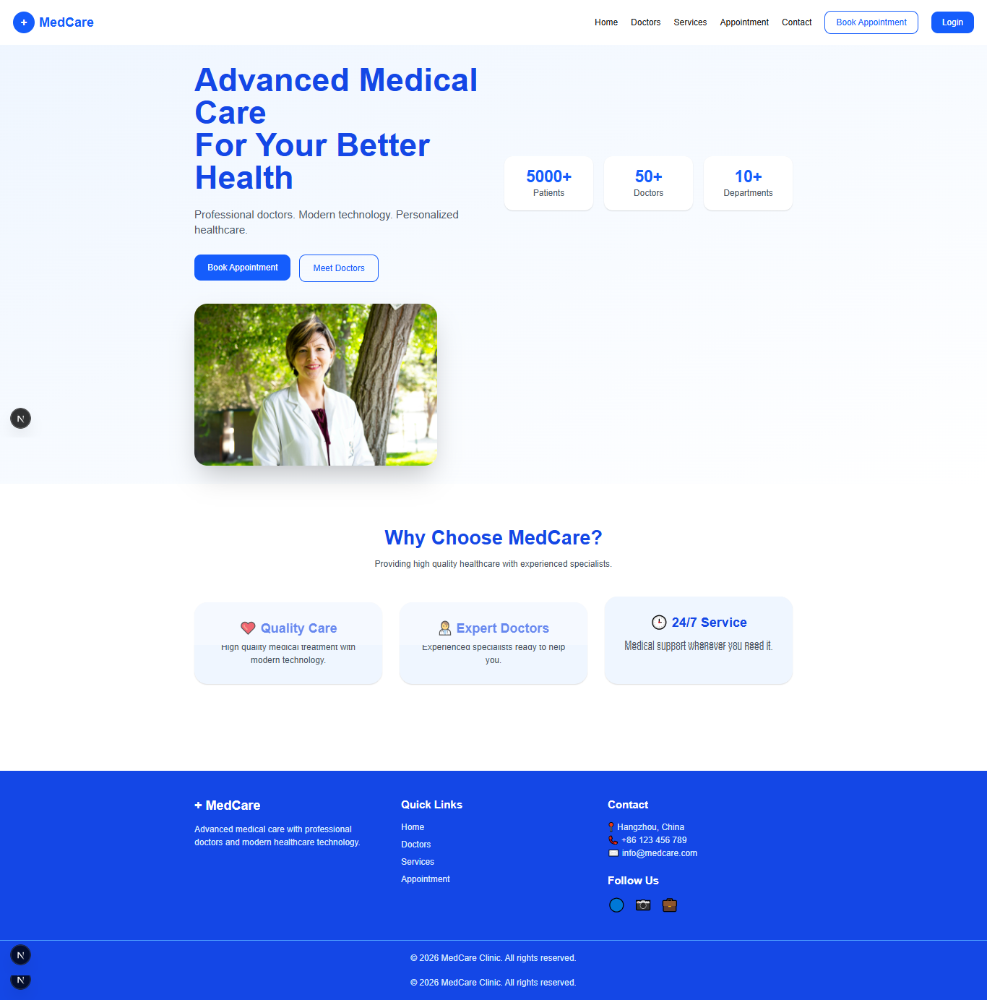
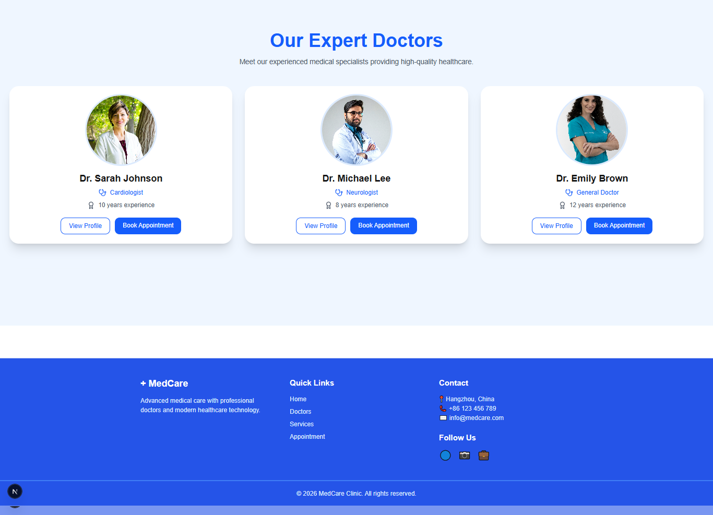
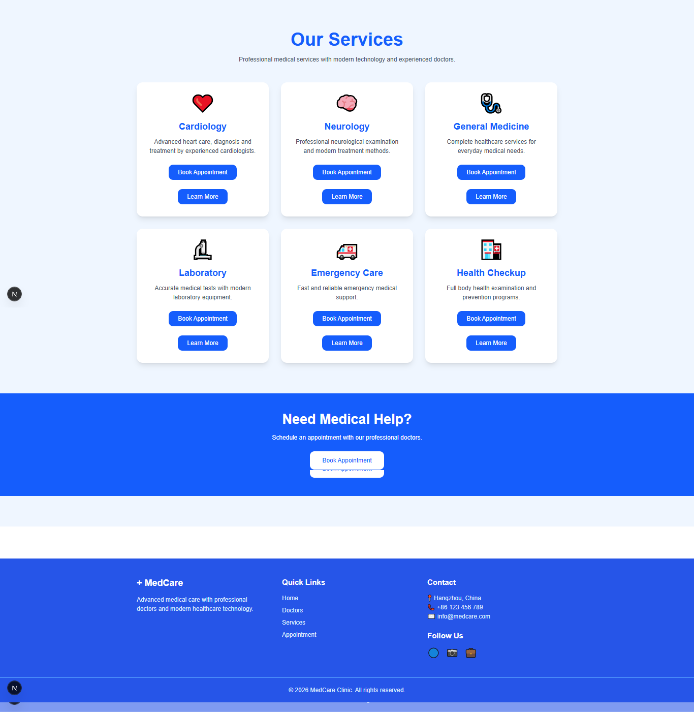
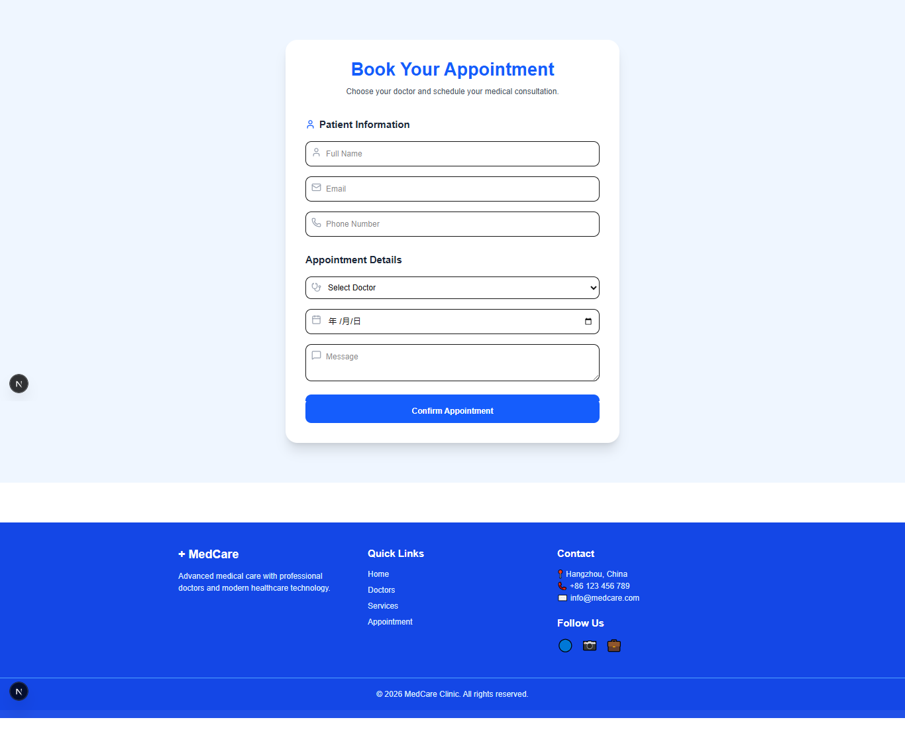
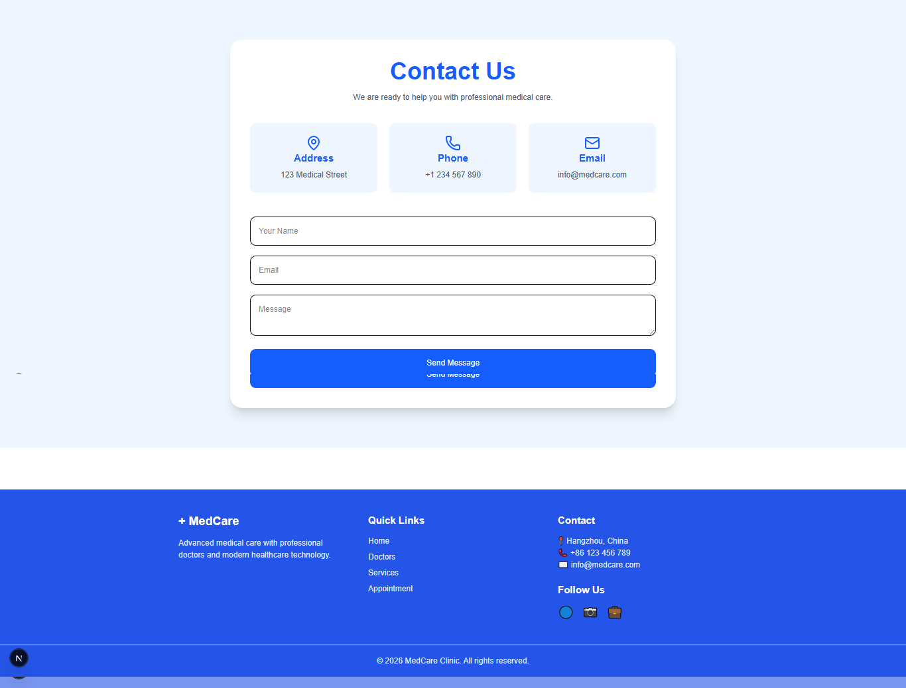
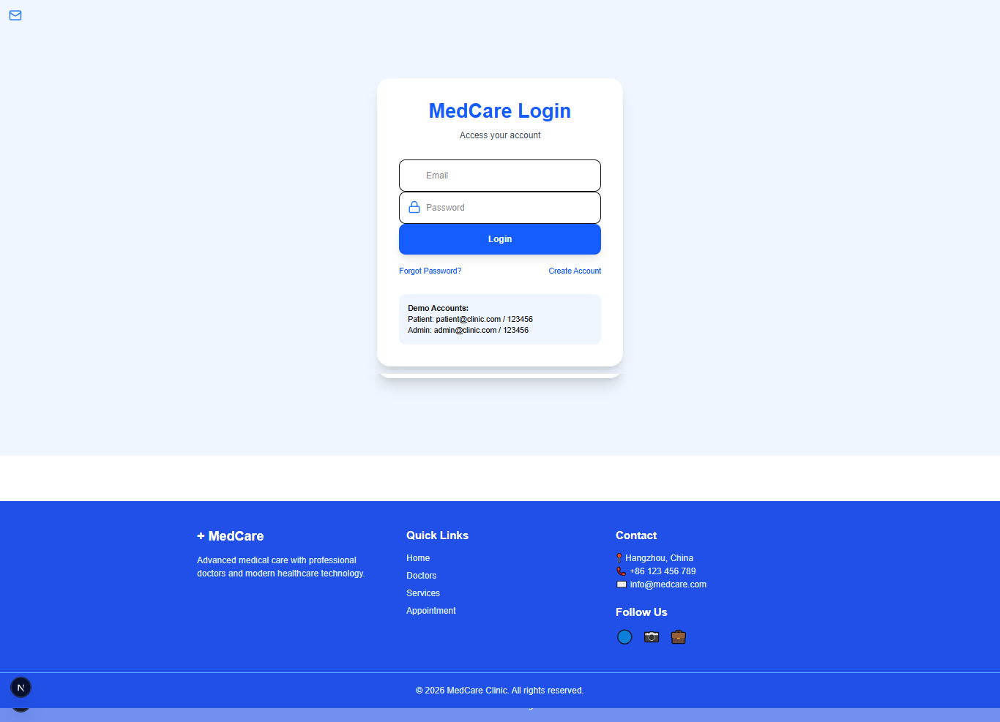

# MedCare Clinic 🏥

A modern medical clinic website built with **Next.js, TypeScript, and Tailwind CSS**.

MedCare Clinic is a professional healthcare platform where patients can explore doctors, view medical services, and book appointments through a clean and responsive interface.

## 🚀 Live Demo

https://medcare-clinic.vercel.app

## ✨ Features

- 🏥 Modern medical clinic landing page
- 👨‍⚕️ Doctors listing and profiles
- 📅 Appointment booking interface
- 🩺 Medical services section
- 📞 Contact page
- 🔐 Login page UI
- 📱 Fully responsive design
- ⚡ Fast performance with Next.js

## 🛠️ Technologies

- Next.js 16
- React
- TypeScript
- Tailwind CSS
- Framer Motion
- Lucide React Icons

## 📂 Project Structure
src/
├── app/
│ ├── doctors/
│ ├── services/
│ ├── appointment/
│ ├── contact/
│ └── login/
│
└── components/
├── Navbar.tsx
└── Footer.tsx

## 📸 Screenshots

### Home Page



### Doctors



### Doctor Profile


### Services



### Appointment



### Contact



### Login



## 📌 Future Improvements

- Backend API integration
- Database for patients and doctors
- Authentication system
- Online appointment management
- Admin dashboard


## 👩‍💻 Author

Gulay998

Frontend Developer Portfolio Project

## ⚙️ Installation

Clone the repository:

```bash
git clone https://github.com/Gulay998/medcare-clinic.git